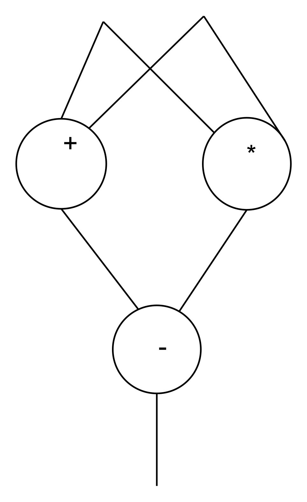

# SAP
Single Assignment Python (SAP) -- Using single assignment and decorators to create dataflow graphs of python programs with an interpreter and on-the-fly code generation

# Quick build and test instructions
Not a lot to try just yet.  Your best bet is to do an install and run the tests.  The current version is Python2 only (I'll do the updates later for Python3)

~~~
% python setup.py install --user
% python -m sap.tests 
~~~

# The idea
The idea is that we can use Python syntax to write single assignment programs.  These have a very simple dataflow representation that can be targeted to compiled code for CPU's, GPU's, or FPGA's.  Since dataflow precisely describes all dependencies, we can find and exploit fine grained parallelism.  We want to experiment with auto-partitioning and auto-scheduling.  There are also a number of cool optimizations that are easy to exploit given a dataflow representation of the code (constant folding, common sub-expression, loop hoisting, loop fusion, etc..).

One thing that is of interest is the use the streaming ideas from the old Sisal language to pull raw packet bits off the wire and stream them through a dataflow filter to build responses off of a live wire feed.  Done right, we can start to form response packets even before the full packet arrives!

# Why single assignment?
Single assignment, at first glance, seems horrible and restrictive.  It goes against all the early lessons we learned in programming!

It is, however, a return to the mathematical languages we all started with.

Think about the code ```x = x + 1;```

Mathmatically, it makes no sense!  How do we define x to be x+1? 

In our coding work, it makes sense only because x represents a bit of memory.  We read the contents of the box on the right hand side, add one to it, and put it back into the box.

The memory boxes are the start of all our problems.  In a general program, it is hard for us to figure out all the dependencies and aliasing going on.  That can restrict us in all sorts of ways, particularly around potential parallelism.  The root of the problem is controlling races around writing and reading data. Because the data boxes (memory locations) are mutable, we must control access with locks.  These are hard to get correct.  And correctness is impossible to test for.

| process 1 | process 2 |
| --- | --- |
```bal = bal + 10``` |  ```bal = bal + 20```

If the initial balance was $0, the final balance could be 10 or 20 or 30.  This is because of the _race condition_  in reading and writing the memory cell named __bal__.  Now, we can solve this problem by using atomic values or with locks, but we have to **see** the problem first (identifying the shared state and protecting it -- and leting all future programers know that the state is shared, etc...).

One way to get around this whole mess is to never allow values to mutate!  Instead of putting values into memory cells, we just make definitions.  The definition never changes.  If you need a new value for something, you just come up with another name.
~~~
bal = 10;
bal1 = bal + 1;
bal2 = bal1 + bal1;
~~~

This solves some problems (and yes, it introduces some more).  There is a nice dataflow dependency described here.  There is never a race even in another thread because bal **is** 10 everywhere.  One could (should) say "bal is defined to be 10" rather than "bal equals 10".  This gives us nice _referential transparency_ in which we can freely exchange the definition for the value (or value for definition).  So it is fine to write any of below with simple substitution.
~~~
bal2 = (bal1 + 1) + (bal1+1);
or
bal2 = ((10+1) + (10+1));
...
~~~

Things get messy in a couple of ways.  The first, and most obvious problem is when we really *do* want to mutate or evolve an object. If _A_ is a large array, and we want _A1_ to be the same array with one element changed, it implies that we have to make a full copy of _A_ (except for the one element).  That can get expensive really fast!

The other problem is in a loop.  We can't create new names for elements in each loop body!  We have to come up with a scheme that allows us to keep single assigment but still allows us to evolve values.

If we can solve these problems though, single assignemnt can make it easy to build computation graphs with full dependency information which can help us to nice partitioning and scheduling work.

# The relationship between single assignment and dataflow
I want to think of programs as acyclic graphs.  These graphs have nice properties that make optimization, partitioning, and scheduling much easier than tradtional procedural languages.  I'll write these using Python single assignment style to illustrate.

~~~python
@SAP(SAP.integer,SAP.integer)
def f(x,y):
    a = x + y
    b = x - y
    return a*b
~~~



The dataflow dependencies show us that we can do the + and - in parallel.  The single assignment names (x, y, a, b) refer to edges in the graph (the un-named output from the return is also an edge).  We set the types of the inputs, but we can infer the types of the outputs (here, all edges are of type integer).   We can also infer the lifetimes of objects.  It's very handy!

# So what about loops?
Loops have an issue with names.  We have a loop body that has a set of names in it.  In single assignment Python, we write loop bodies this way:
~~~python
@SAP(SAP.integer)
def f(n):
	i = 0
	sum = 0
	while i < n:
		i = old(i)+1
		sum = old(sum) + i
		result = yield sum
	return result
~~~

This loop maintains state via the "old" keyword.  This allows us to create a new set of names in each loop body that ties back to the previous (old) names from the prior iteratoration (or from outside the loop).

So, outside the loop, the value of ```i``` is 0 as is the value of sum.  Inside the first iteration, ```i``` is redefined to be the sum of the previous value of i ( ```old(i)```) plus 1.  So in the first iteration we get


| symbol | value |
| --- | --- |
old(i) | 0
i | 1
old(sum) | 0
sum | 1

In the next iteration, the values of i and sum get _copied forward_ and we can create new values for i and sum.  The labeled yield describes the value that escapes the loop. 

| symbol | value |
| --- | --- |
old(i) | 1
i | 2
old(sum) | 1
sum | 3

and then 

| symbol | value |
| --- | --- |
old(i) | 2
i | 3
old(sum) | 3
sum | 6

and so on...

 So, in the outer level, if ```n``` is the names are:
 
| symbol | value |
| --- | --- |
n | 3
i | 0
sum | 0
result |  6

Note that i and sum **do not** get updated.

